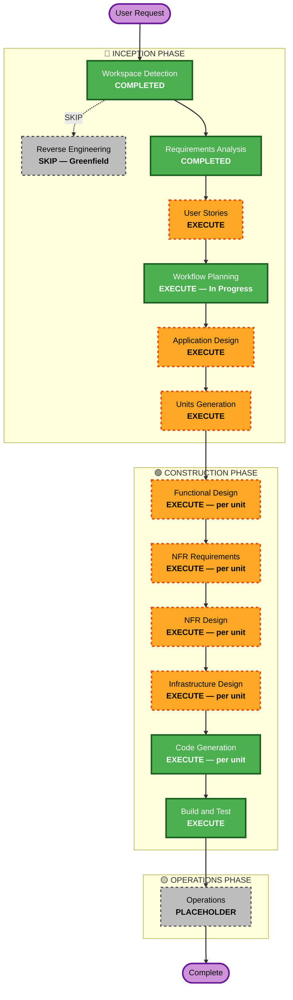

# Execution Plan — Decision-Fabric-AI

## Detailed Analysis Summary

### Change Impact Assessment

| Impact Area | Assessment | Description |
|---|---|---|
| **User-facing changes** | Yes | New system — exposes REST APIs for decision consumers and rule administrators |
| **Structural changes** | Yes | Greenfield: defining entire architecture from scratch |
| **Data model changes** | Yes | New: DMN rule models, decision request/response models, audit log schema |
| **API changes** | Yes | New: Rules CRUD API, Decision evaluation API, Audit query API |
| **NFR impact** | Yes | Full NFR stack: performance (<200ms), security (SECURITY-01/02/03), scalability, observability |

### Risk Assessment

| Field | Assessment |
|---|---|
| **Risk Level** | High |
| **Rationale** | Enterprise-grade, multi-component greenfield system; DMN compliance + AI integration + security enforcement; complex dependency chain |
| **Rollback Complexity** | Moderate (greenfield, but external LLM API dependency and AWS infrastructure) |
| **Testing Complexity** | Complex (unit + integration + DMN schema validation + AI fallback + performance) |

---

## Workflow Visualization

### Legend
- **Green (solid)**: Always executes / Completed
- **Orange (dashed)**: Conditional — EXECUTE
- **Gray (dashed)**: Conditional — SKIP
- **Purple**: Start / End

---

## Phases to Execute

### INCEPTION PHASE

- [x] **Workspace Detection** — COMPLETED
- [ ] **Reverse Engineering** — SKIP (Greenfield project, no existing codebase)
- [x] **Requirements Analysis** — COMPLETED
- [ ] **User Stories** — EXECUTE
  - *Rationale*: Mixed audience (business + technical users), complex business rules (DMN + AI augmentation), multiple consumer personas (rule admins, decision consumers, external integrators), customer-facing API, cross-team collaboration value
- [ ] **Workflow Planning** — EXECUTE (current stage)
- [ ] **Application Design** — EXECUTE
  - *Rationale*: New system with multiple distinct components: DMN Engine, AI Orchestration, API Gateway, Rule Repository, Audit Service; component boundaries and service layer design needed
- [ ] **Units Generation** — EXECUTE
  - *Rationale*: Complex multi-component system needs decomposition into independently developable units; API, engine, and infrastructure layers are logically distinct units

### CONSTRUCTION PHASE (per-unit)

- [ ] **Functional Design** — EXECUTE (per unit)
  - *Rationale*: New data models (DMN models, decision requests, audit logs), complex business logic (DMN evaluation, FEEL expressions, AI augmentation thresholds), decision chaining rules
- [ ] **NFR Requirements** — EXECUTE (per unit)
  - *Rationale*: Performance (<200ms p99), security (SECURITY-01/02/03 enforced), scalability (tens of thousands/day), 99.9% SLA all require explicit NFR design
- [ ] **NFR Design** — EXECUTE (per unit)
  - *Rationale*: NFR Requirements will be executed; NFR patterns (circuit breakers, encryption, structured logging, auto-scaling) need explicit design
- [ ] **Infrastructure Design** — EXECUTE (per unit)
  - *Rationale*: AWS multi-AZ deployment, ECS/EKS or Lambda selection, API Gateway, KMS, CloudWatch, VPC networking all require specification
- [ ] **Code Generation** — EXECUTE (per unit, ALWAYS)
- [ ] **Build and Test** — EXECUTE (ALWAYS)

### OPERATIONS PHASE

- [ ] **Operations** — PLACEHOLDER (future)

---

## Stage Rationale Summary

| Stage | Decision | Key Reason |
|---|---|---|
| Workspace Detection | COMPLETED | Always executes |
| Reverse Engineering | SKIP | Greenfield |
| Requirements Analysis | COMPLETED | Always executes |
| User Stories | EXECUTE | Mixed personas, complex rules, customer-facing API |
| Workflow Planning | EXECUTE | Always executes |
| Application Design | EXECUTE | Multiple new components, service layer needed |
| Units Generation | EXECUTE | Multi-component system needs unit decomposition |
| Functional Design | EXECUTE | New data models + complex DMN/AI business logic |
| NFR Requirements | EXECUTE | Security, performance, scalability all required |
| NFR Design | EXECUTE | NFR patterns must be explicitly designed |
| Infrastructure Design | EXECUTE | AWS architecture, multi-AZ, KMS, networking |
| Code Generation | EXECUTE | Always executes |
| Build and Test | EXECUTE | Always executes |
